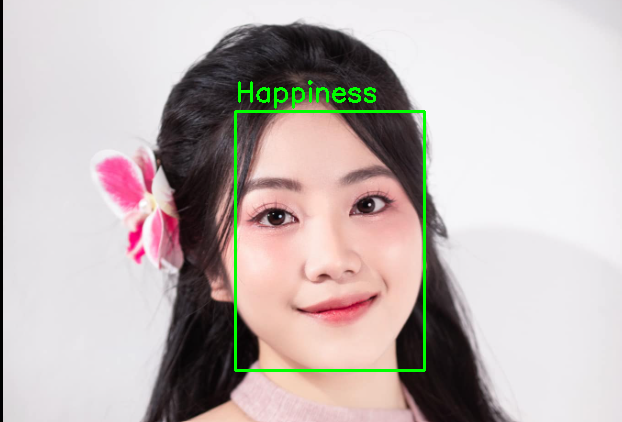
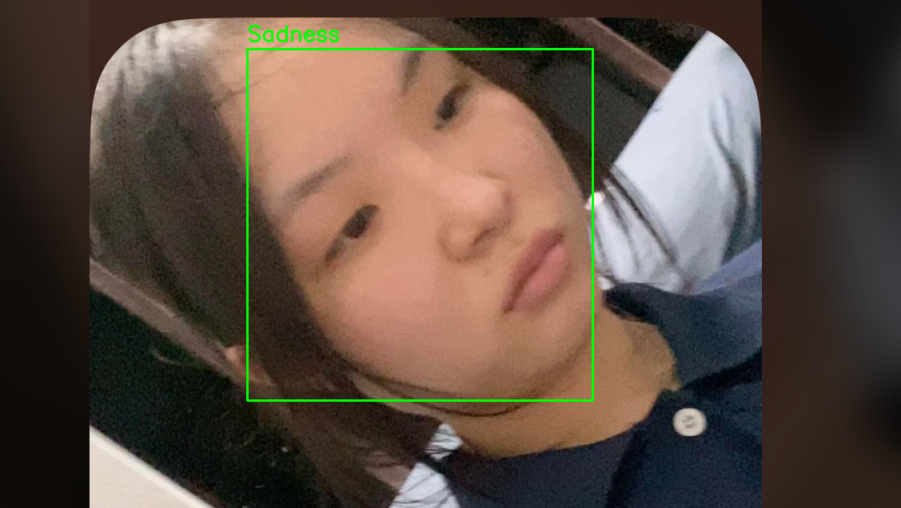

# Emotion Recognition SVM

Dự án nhận diện cảm xúc khuôn mặt sử dụng Support Vector Machine (SVM) với HOG (Histogram of Oriented Gradients) features. Mô hình được huấn luyện trên tập dữ liệu RAF-DB và có khả năng phân loại 7 loại cảm xúc khác nhau.

## Mục Lục

- [Tính Năng](#tính-năng)
- [Cảm Xúc Được Hỗ Trợ](#cảm-xúc-được-hỗ-trợ)
- [Yêu Cầu](#yêu-cầu)
- [Cài Đặt](#cài-đặt)
- [Cách Sử Dụng](#cách-sử-dụng)
- [Cấu Trúc Dự Án](#cấu-trúc-dự-án)
- [Kết Quả](#kết-quả)
- [Tài Liệu Tham Khảo](#tài-liệu-tham-khảo)

## Tính Năng

- **Phát hiện khuôn mặt**: Sử dụng MTCNN (Multi-task Cascaded Convolutional Networks) để phát hiện khuôn mặt
- **Trích xuất đặc trưng**: Sử dụng HOG features để trích xuất đặc trưng từ khuôn mặt
- **Phân loại cảm xúc**: Sử dụng SVM để phân loại 7 loại cảm xúc
- **Xử lý hàng loạt**: Có thể xử lý nhiều ảnh cùng lúc
- **Trực quan hóa kết quả**: Vẽ bounding box và nhãn cảm xúc lên ảnh

## Cảm Xúc Được Hỗ Trợ

Mô hình có thể nhận diện 7 loại cảm xúc:

1. **Surprise** (Ngạc nhiên)
2. **Fear** (Sợ hãi)
3. **Disgust** (Ghê tởm)
4. **Happiness** (Vui vẻ)
5. **Sadness** (Buồn)
6. **Anger** (Tức giận)
7. **Normal** (Bình thường)

## Yêu Cầu

```
Python 3.7+
opencv-python
mtcnn
scikit-image
scikit-learn
joblib
numpy
pandas
matplotlib
seaborn
Pillow
```

## Cài Đặt

1. Clone dự án:
```bash
git clone https://github.com/bignohtinf/Emotion-RecognitionSVM.git
cd Emotion-RecognitionSVM
```

2. Cài đặt các thư viện cần thiết:
```bash
pip install -r requirements.txt
```

3. Tải tập dữ liệu RAF-DB (nếu muốn huấn luyện lại):
```bash
# Truy cập https://www.kaggle.com/datasets/shuvoalok/raf-db-dataset/data
# Tải xuống và giải nén vào thư mục dự án
```

## Cách Sử Dụng

### 1. Sử Dụng Mô Hình Đã Huấn Luyện

Chạy script inference để xử lý ảnh:

```bash
python inference/svm_img_vid.py
```

**Cấu trúc thư mục:**
- Đặt ảnh đầu vào vào: `inference/DATA/IN/`
- Kết quả sẽ được lưu vào: `inference/DATA/OUT/`

**Ví dụ:**
```
inference/
├── DATA/
│   ├── IN/
│   │   ├── An.png
│   │   ├── Hadoi.png
│   │   └── ...
│   └── OUT/
│       ├── Happiness_An.png
│       ├── Sadness_Hadoi.png
│       └── ...
├── MODEL/
│   └── svm_model_0.7516_size100.joblib
└── svm_img_vid.py
```

### 2. Huấn Luyện Mô Hình (Tùy Chọn)

Chạy notebook `final_RAF_size_100.ipynb` để:
- Tải và chuẩn bị dữ liệu RAF-DB
- Trích xuất HOG features
- Huấn luyện mô hình SVM
- Đánh giá hiệu suất

## Kết Quả

Mô hình đạt được:
- **Độ chính xác (Accuracy)**: 75.16%
- **Kích thước ảnh đầu vào**: 100x100 pixels
- **Số lượng features**: HOG features từ ảnh 100x100

### Ví Dụ Kết Quả

<p align="center">
  
  
  
</p>

<p align="center"><b>Đầu vào</b></p>

<p align="center">
  
  
  
</p>

<p align="center"><b>Đầu ra</b></p>

## Cấu Trúc Dự Án

```
emotion-recognition-svm/
├── README.md                          # Tài liệu này
├── final_RAF_size_100.ipynb          # Notebook huấn luyện
├── inference/
│   ├── svm_img_vid.py                # Script inference
│   ├── DATA/
│   │   ├── IN/                       # Ảnh đầu vào
│   │   └── OUT/                      # Ảnh đầu ra
│   └── MODEL/
│       ├── svm_model_0.7516_size100.joblib  # Mô hình đã huấn luyện
│       └── mode.txt
└── .gitignore
```

## Chi Tiết Kỹ Thuật

### Quy Trình Xử Lý

1. **Phát hiện khuôn mặt**: MTCNN phát hiện tất cả khuôn mặt trong ảnh
2. **Tiền xử lý**: Resize khuôn mặt về 100x100 pixels
3. **Trích xuất đặc trưng**: Tính HOG features với:
   - Orientations: 9
   - Pixels per cell: (8, 8)
   - Cells per block: (2, 2)
   - Block norm: L2-Hys
4. **Dự đoán**: SVM phân loại cảm xúc
5. **Trực quan hóa**: Vẽ kết quả lên ảnh gốc

### Tham Số Mô Hình

- **Kích thước ảnh**: 100x100 pixels
- **Số lượng cảm xúc**: 7 classes
- **Thuật toán**: Support Vector Machine (SVM)
- **Đặc trưng**: HOG (Histogram of Oriented Gradients)

## Hiệu Suất

Mô hình được đánh giá trên tập test của RAF-DB:
- Accuracy: 75.16%
- Hỗ trợ 7 loại cảm xúc khác nhau
- Xử lý nhanh chóng trên CPU

## Khắc Phục Sự Cố

**Lỗi: "Could not read image"**
- Kiểm tra đường dẫn ảnh
- Đảm bảo ảnh ở định dạng .jpg hoặc .png

**Lỗi: "Model not found"**
- Kiểm tra file mô hình tồn tại trong `inference/MODEL/`
- Đảm bảo tên file khớp với biến `model_name`

**Lỗi: "No faces detected"**
- Ảnh phải chứa khuôn mặt rõ ràng
- Thử với ảnh có độ phân giải cao hơn

## Tài Liệu Tham Khảo

- **RAF-DB Dataset**: https://www.kaggle.com/datasets/shuvoalok/raf-db-dataset/data
- **MTCNN**: https://github.com/ipazc/mtcnn
- **Scikit-image HOG**: https://scikit-image.org/docs/stable/api/skimage.feature.html#hog
- **Scikit-learn SVM**: https://scikit-learn.org/stable/modules/svm.html

## Ghi Chú

- Mô hình được huấn luyện trên tập dữ liệu RAF-DB
- Hiệu suất có thể thay đổi tùy thuộc vào chất lượng ảnh đầu vào
- Khuyến nghị sử dụng ảnh có độ phân giải tối thiểu 100x100 pixels

## License

Dự án này được cấp phép dưới MIT License.

## Tác Giả

Dự án nhận diện cảm xúc khuôn mặt sử dụng SVM
